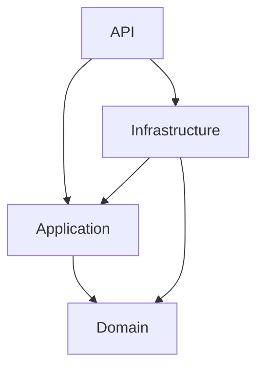
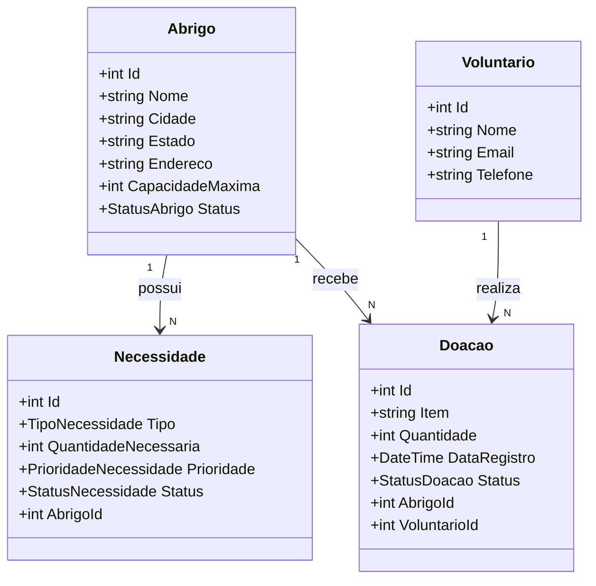
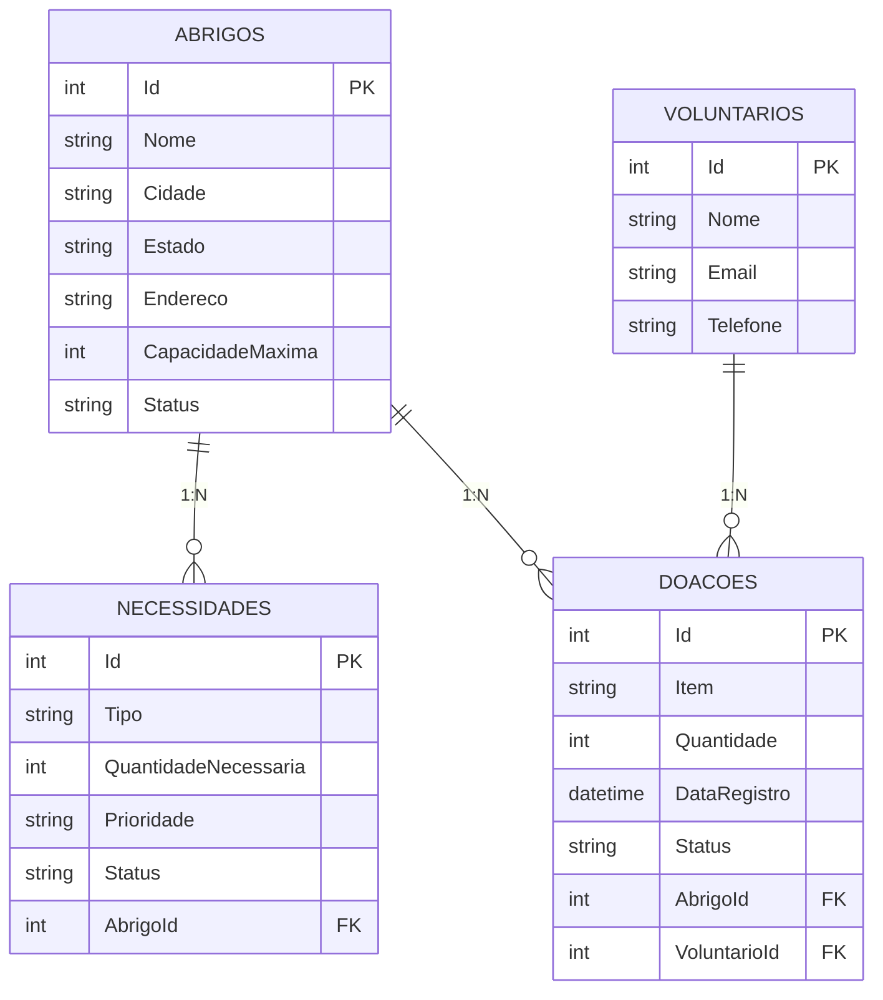

# SmartDisaster Portal

## Objetivo

O **SmartDisaster Portal** é uma API RESTful para gestão de emergências e desastres, utilizada por coordenadores de operações. Permite administrar abrigos, necessidades, voluntários e doações em situações de crise.

---

## Links importantes

| Recurso | URL |
|---|---|
| Vídeo Pitch | https://youtu.be/ItPEbWxzNkw |
| Vídeo de explicação do projeto |https://youtu.be/FzQ4HI2nOgY |
---

## Arquitetura

O projeto segue **Clean Architecture**, garantindo separação de responsabilidades e independência entre as camadas:

```
┌─────────────────────────────────────────┐
│                   API                   │  ← Controllers, Swagger, DI
├─────────────────────────────────────────┤
│              Infrastructure             │  ← DbContext, Repositories, Migrations
├─────────────────────────────────────────┤
│              Application                │  ← Services, Interfaces, DTOs
├─────────────────────────────────────────┤
│                 Domain                  │  ← Entidades, Enums, Regras
└─────────────────────────────────────────┘
```

**Regra de dependência:** as camadas externas dependem das internas. O Domain nunca depende de nada.

### Diagrama de Arquitetura (Mermaid)



---

## Estrutura do Projeto

```
SmartDisaster.sln
├── Domain/
│   ├── Entities/
│   │   ├── Abrigo.cs
│   │   ├── Necessidade.cs
│   │   ├── Voluntario.cs
│   │   └── Doacao.cs
│   └── Enums/
│       ├── StatusAbrigo.cs
│       ├── TipoNecessidade.cs
│       ├── PrioridadeNecessidade.cs
│       ├── StatusNecessidade.cs
│       └── StatusDoacao.cs
│
├── Application/
│   ├── Interfaces/
│   │   ├── IRepository.cs
│   │   ├── IAbrigoRepository.cs  (+ Necessidade, Voluntario, Doacao)
│   │   ├── IAbrigoService.cs     (+ Necessidade, Voluntario, Doacao)
│   ├── DTOs/
│   │   ├── Abrigo/      (Create, Update, Response)
│   │   ├── Necessidade/ (Create, Update, Response)
│   │   ├── Voluntario/  (Create, Update, Response)
│   │   └── Doacao/      (Create, Update, Response)
│   └── Services/
│       ├── AbrigoService.cs
│       ├── NecessidadeService.cs
│       ├── VoluntarioService.cs
│       └── DoacaoService.cs
│
├── Infrastructure/
│   ├── Data/
│   │   ├── AppDbContext.cs
│   │   └── SeedData.cs
│   ├── Configurations/
│   │   ├── AbrigoConfiguration.cs
│   │   ├── NecessidadeConfiguration.cs
│   │   ├── VoluntarioConfiguration.cs
│   │   └── DoacaoConfiguration.cs
│   ├── Repositories/
│   │   ├── Repository.cs          (genérico)
│   │   ├── AbrigoRepository.cs
│   │   ├── NecessidadeRepository.cs
│   │   ├── VoluntarioRepository.cs
│   │   └── DoacaoRepository.cs
│   └── Migrations/
│       └── InitialCreate...
│
└── API/
    ├── Controllers/
    │   ├── AbrigosController.cs
    │   ├── NecessidadesController.cs
    │   ├── VoluntariosController.cs
    │   └── DoacoesController.cs
    ├── Program.cs
    └── appsettings.json
```

---

## Tecnologias

| Tecnologia | Versão |
|---|---|
| .NET | 9.0 |
| ASP.NET Core | 9.0 |
| Entity Framework Core | 9.0.5 |
| SQLite | (via EF Core provider) |
| Swashbuckle (Swagger) | 7.3.1 |

---

## Banco de Dados

- **Banco:** SQLite
- **Arquivo:** `smartdisaster.db` (criado automaticamente na raiz do projeto API)
- **Gerenciamento:** Migrations reais do EF Core (sem `EnsureCreated`)
- **Seed:** Dados iniciais inseridos automaticamente na primeira execução

---

## Entidades e Relacionamentos

### Diagrama de Classes (Mermaid)



### Diagrama ER (Mermaid)



### Regras dos Relacionamentos

| Relacionamento | Comportamento ao excluir |
|---|---|
| Abrigo → Necessidades | **Cascade Delete** — necessidades são excluídas junto |
| Abrigo → Doações | **Cascade Delete** — doações do abrigo são excluídas |
| Voluntário → Doações | **Restrict** — não é possível excluir voluntário com doações vinculadas |

---

## Migrations

As migrations são gerenciadas pelo EF Core e aplicadas automaticamente ao iniciar a API.

### Criar migration (após alterações no modelo):
```bash
dotnet ef migrations add NomeDaMigration --project Infrastructure --startup-project API
```

### Atualizar banco manualmente:
```bash
dotnet ef database update --project Infrastructure --startup-project API
```

### Remover última migration:
```bash
dotnet ef migrations remove --project Infrastructure --startup-project API
```

---

## Como Executar

### Pré-requisitos
- [.NET 9 SDK](https://dotnet.microsoft.com/download/dotnet/9.0)
- EF Core Tools (`dotnet tool install --global dotnet-ef`)

### Passos

```bash
# 1. Restaurar dependências
dotnet restore

# 2. Compilar
dotnet build

# 3. Executar a API (migrations e seed aplicados automaticamente)
dotnet run --project API
```

A API estará disponível em `http://localhost:{porta}/` com Swagger na raiz.
> A porta exata é exibida no terminal após o `dotnet run`, ex: `Now listening on: http://localhost:5062`

---

## Rotas da API

### Abrigos — `/api/abrigos`

| Método | Rota | Descrição |
|---|---|---|
| GET | `/api/abrigos` | Lista todos os abrigos |
| GET | `/api/abrigos/{id}` | Busca abrigo por ID |
| POST | `/api/abrigos` | Cadastra novo abrigo |
| PUT | `/api/abrigos/{id}` | Atualiza abrigo |
| DELETE | `/api/abrigos/{id}` | Remove abrigo (cascade) |

### Necessidades — `/api/necessidades`

| Método | Rota | Descrição |
|---|---|---|
| GET | `/api/necessidades` | Lista todas as necessidades |
| GET | `/api/necessidades/{id}` | Busca necessidade por ID |
| POST | `/api/necessidades` | Registra necessidade |
| PUT | `/api/necessidades/{id}` | Atualiza necessidade |
| DELETE | `/api/necessidades/{id}` | Remove necessidade |

### Voluntários — `/api/voluntarios`

| Método | Rota | Descrição |
|---|---|---|
| GET | `/api/voluntarios` | Lista todos os voluntários |
| GET | `/api/voluntarios/{id}` | Busca voluntário por ID |
| POST | `/api/voluntarios` | Cadastra voluntário |
| PUT | `/api/voluntarios/{id}` | Atualiza voluntário |
| DELETE | `/api/voluntarios/{id}` | Remove voluntário |

### Doações — `/api/doacoes`

| Método | Rota | Descrição |
|---|---|---|
| GET | `/api/doacoes` | Lista todas as doações |
| GET | `/api/doacoes/{id}` | Busca doação por ID |
| POST | `/api/doacoes` | Registra doação |
| PUT | `/api/doacoes/{id}` | Atualiza doação |
| DELETE | `/api/doacoes/{id}` | Remove doação |

---

## Exemplos de Requisição

### POST /api/abrigos
```json
{
  "nome": "Abrigo Norte",
  "cidade": "Fortaleza",
  "estado": "CE",
  "endereco": "Av. Bezerra de Menezes, 500",
  "capacidadeMaxima": 200,
  "status": 1
}
```
> Status: `1 = Ativo`, `2 = Lotado`, `3 = Inativo`

### POST /api/necessidades
```json
{
  "tipo": 1,
  "quantidadeNecessaria": 300,
  "prioridade": 4,
  "status": 1,
  "abrigoId": 1
}
```
> Tipo: `1=Alimento, 2=Medicamento, 3=Roupa, 4=Higiene, 5=Agua, 6=Outros`  
> Prioridade: `1=Baixa, 2=Media, 3=Alta, 4=Critica`

### POST /api/voluntarios
```json
{
  "nome": "João Silva",
  "email": "joao.silva@email.com",
  "telefone": "(11) 99999-0000"
}
```

### POST /api/doacoes
```json
{
  "item": "Fraldas Descartáveis",
  "quantidade": 200,
  "status": 1,
  "abrigoId": 1,
  "voluntarioId": 1
}
```
> StatusDoacao: `1=Registrada, 2=EmTransito, 3=Entregue, 4=Cancelada`

---

## Exemplos de Resposta

### GET /api/abrigos/1
```json
{
  "id": 1,
  "nome": "Abrigo Central São Paulo",
  "cidade": "São Paulo",
  "estado": "SP",
  "endereco": "Av. Paulista, 1500 - Bela Vista",
  "capacidadeMaxima": 500,
  "status": "Ativo",
  "totalNecessidades": 2,
  "totalDoacoes": 2
}
```

### GET /api/necessidades/1
```json
{
  "id": 1,
  "tipo": "Alimento",
  "quantidadeNecessaria": 1000,
  "prioridade": "Critica",
  "status": "Pendente",
  "abrigoId": 1,
  "nomeAbrigo": "Abrigo Central São Paulo"
}
```

---

## Validações

Todos os endpoints validam automaticamente via `DataAnnotations`. Em caso de erro:

```json
{
  "type": "https://tools.ietf.org/html/rfc7231#section-6.5.1",
  "title": "One or more validation errors occurred.",
  "status": 400,
  "errors": {
    "Nome": ["O nome é obrigatório."],
    "Estado": ["O estado deve ter exatamente 2 caracteres (ex: SP)."]
  }
}
```

---

## Dados Iniciais (Seed)

Na primeira execução, o sistema carrega automaticamente:

- **3 Abrigos:** São Paulo (SP), Rio de Janeiro (RJ), Curitiba (PR)
- **3 Voluntários:** Ana Lima, Carlos Mendes, Fernanda Costa
- **5 Necessidades:** distribuídas pelos 3 abrigos
- **5 Doações:** vinculadas aos abrigos e voluntários

---

## Testes

### Acesso ao Swagger

Após iniciar a API com `dotnet run --project API`, o terminal exibirá a porta:

```
Now listening on: http://localhost:5062
```

Abra no navegador a URL exibida (ex: `http://localhost:5062/`).

O **Swagger UI** abre automaticamente na raiz. Todos os endpoints estão documentados e podem ser testados diretamente pela interface.

---

### Roteiro de Testes via Swagger

#### Passo 1 — Verificar os dados do Seed

Acesse `GET /api/abrigos` → deve retornar os 3 abrigos cadastrados automaticamente.

**Resposta esperada (200 OK):**
```json
[
  {
    "id": 1,
    "nome": "Abrigo Central São Paulo",
    "cidade": "São Paulo",
    "estado": "SP",
    "capacidadeMaxima": 500,
    "status": "Ativo",
    "totalNecessidades": 2,
    "totalDoacoes": 2
  },
  ...
]
```

#### Passo 2 — Cadastrar um novo Abrigo (POST)

`POST /api/abrigos` com body:
```json
{
  "nome": "Abrigo Norte",
  "cidade": "Fortaleza",
  "estado": "CE",
  "endereco": "Av. Bezerra de Menezes, 500 - Jacarecanga",
  "capacidadeMaxima": 150,
  "status": 1
}
```
**Resposta esperada: 201 Created** com o objeto criado e `id: 4`.

#### Passo 3 — Buscar pelo ID (GET by ID)

`GET /api/abrigos/4` → deve retornar o abrigo recém-criado.  
`GET /api/abrigos/999` → deve retornar **404 Not Found**.

#### Passo 4 — Atualizar um Abrigo (PUT)

`PUT /api/abrigos/4`:
```json
{
  "nome": "Abrigo Norte Expandido",
  "cidade": "Fortaleza",
  "estado": "CE",
  "endereco": "Av. Bezerra de Menezes, 500 - Jacarecanga",
  "capacidadeMaxima": 300,
  "status": 2
}
```
**Resposta esperada: 200 OK** com `capacidadeMaxima: 300` e `status: "Lotado"`.

#### Passo 5 — Registrar uma Necessidade vinculada ao novo Abrigo

`POST /api/necessidades`:
```json
{
  "tipo": 1,
  "quantidadeNecessaria": 500,
  "prioridade": 4,
  "status": 1,
  "abrigoId": 4
}
```
**Resposta esperada: 201 Created** com `nomeAbrigo: "Abrigo Norte Expandido"`.

#### Passo 6 — Registrar uma Doação

`POST /api/doacoes`:
```json
{
  "item": "Cesta Básica Grande",
  "quantidade": 50,
  "status": 1,
  "abrigoId": 4,
  "voluntarioId": 1
}
```
**Resposta esperada: 201 Created** com `nomeAbrigo` e `nomeVoluntario` preenchidos.

#### Passo 7 — Testar Validação (POST inválido)

`POST /api/abrigos` com body inválido:
```json
{
  "nome": "A",
  "cidade": "",
  "estado": "SP",
  "capacidadeMaxima": -1,
  "status": 1
}
```
**Resposta esperada: 400 Bad Request** com `ValidationProblemDetails`:
```json
{
  "title": "One or more validation errors occurred.",
  "status": 400,
  "errors": {
    "Nome": ["O nome deve ter entre 3 e 100 caracteres."],
    "Cidade": ["A cidade é obrigatória."],
    "CapacidadeMaxima": ["A capacidade deve ser entre 1 e 10.000 pessoas."]
  }
}
```

#### Passo 8 — Testar Cascade Delete

1. Verifique `GET /api/necessidades` e note as necessidades do Abrigo 4
2. Execute `DELETE /api/abrigos/4` → **204 No Content**
3. Acesse `GET /api/necessidades` novamente → as necessidades vinculadas ao Abrigo 4 foram removidas automaticamente pelo **Cascade Delete**

---

### Testes via arquivo HTTP (VS Code REST Client)

Para testar usando o arquivo `smartdisaster.http` (na raiz do projeto):

1. Instale a extensão **REST Client** no VS Code
2. Abra o arquivo `smartdisaster.http`
3. Clique em **"Send Request"** acima de cada bloco

---

### Tabela de Códigos HTTP esperados

| Operação | Endpoint | Código esperado |
|---|---|---|
| Listar todos | GET /api/abrigos | 200 OK |
| Buscar por ID existente | GET /api/abrigos/1 | 200 OK |
| Buscar por ID inexistente | GET /api/abrigos/999 | 404 Not Found |
| Criar válido | POST /api/abrigos | 201 Created |
| Criar inválido | POST /api/abrigos (body errado) | 400 Bad Request |
| Atualizar existente | PUT /api/abrigos/1 | 200 OK |
| Atualizar inexistente | PUT /api/abrigos/999 | 404 Not Found |
| Excluir existente | DELETE /api/abrigos/1 | 204 No Content |
| Excluir inexistente | DELETE /api/abrigos/999 | 404 Not Found |

---

## Por que Clean Architecture?

| Benefício | Explicação |
|---|---|
| **Independência** | Domain não depende de banco, framework ou UI |
| **Testabilidade** | Serviços e repositórios podem ser mockados isoladamente |
| **Manutenibilidade** | Cada camada tem responsabilidade única |
| **Flexibilidade** | Trocar SQLite por PostgreSQL = mudar só Infrastructure |
| **Escalabilidade** | Adicionar nova funcionalidade = adicionar entidade + DTO + service + controller |

### Como adicionar uma nova funcionalidade (ex: Equipe de Resgate)?

1. **Domain:** criar `EquipeResgate.cs` e enums necessários
2. **Application:** criar `IEquipeResgateRepository`, `IEquipeResgateService`, DTOs
3. **Infrastructure:** criar `EquipeResgateConfiguration.cs`, `EquipeResgateRepository.cs`, adicionar `DbSet` no `AppDbContext`
4. **API:** criar `EquipesResgateController.cs`
5. Registrar no `Program.cs` e gerar nova migration

---

## Conclusão

O SmartDisaster Portal demonstra na prática como Clean Architecture organiza um sistema corporativo real:

- **Domain** define as regras e entidades do negócio de emergências
- **Application** orquestra os casos de uso através de serviços e DTOs
- **Infrastructure** implementa o acesso a dados com EF Core e SQLite
- **API** expõe os endpoints REST com validação e documentação Swagger

A arquitetura garante que qualquer mudança seja localizada na camada correta, sem impactar as demais.
